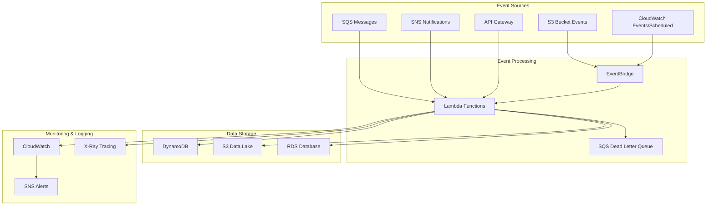

# 🏗️ Event-Driven Architecture Documentation

## Overview

This repository implements a serverless event-driven architecture using AWS services orchestrated with Terraform. The architecture is designed to handle asynchronous events, process them through Lambda functions, and maintain state through various AWS services.

## 📊 Architecture Diagram



## 🔧 Core Components

### 1. Event Sources
- **S3 Bucket Events**: File uploads, deletions, modifications
- **SQS Queues**: Asynchronous message processing
- **SNS Topics**: Pub/Sub messaging patterns
- **API Gateway**: HTTP/REST API triggers
- **CloudWatch Events**: Scheduled and rule-based triggers

### 2. Event Processing Layer
- **EventBridge**: Central event routing and filtering
- **Lambda Functions**: Serverless compute for event processing
- **Dead Letter Queues**: Failed message handling and retry logic

### 3. Data Storage
- **DynamoDB**: NoSQL database for high-performance data access
- **S3**: Object storage for files and data lakes
- **RDS**: Relational database for complex queries

### 4. Monitoring & Observability
- **CloudWatch**: Metrics, logs, and alarms
- **X-Ray**: Distributed tracing and performance insights
- **SNS**: Alert notifications

## 🚀 Event Flow Patterns

### Pattern 1: File Processing Pipeline
```
S3 Upload → EventBridge → Lambda → Process File → Store Results in DynamoDB
```

### Pattern 2: Message Queue Processing
```
Producer → SQS → Lambda → Business Logic → Output to S3/DynamoDB
```

### Pattern 3: Pub/Sub Notification
```
Event → SNS Topic → Multiple Lambda Subscribers → Parallel Processing
```

### Pattern 4: Scheduled Processing
```
CloudWatch Event Rule → Lambda → Batch Processing → Results Storage
```

## 📋 Infrastructure Components

### Terraform Modules Structure
```
terraform/
├── modules/
│   ├── eventbridge/
│   ├── lambda/
│   ├── sqs/
│   ├── sns/
│   ├── dynamodb/
│   └── monitoring/
├── environments/
│   ├── dev/
│   ├── staging/
│   └── prod/
└── main.tf
```

### Key Resources Created
- **EventBridge Custom Bus**: Central event routing
- **Lambda Functions**: Event processors with different runtime configurations
- **SQS Queues**: Message queues with dead letter queue support
- **SNS Topics**: Notification distribution
- **DynamoDB Tables**: Event state and data storage
- **CloudWatch Log Groups**: Centralized logging
- **IAM Roles & Policies**: Least privilege access

## 🔐 Security Considerations

### IAM Permissions
- Lambda execution roles with minimal required permissions
- Cross-service access using IAM roles instead of access keys
- Resource-based policies for service-to-service communication

### Data Encryption
- DynamoDB encryption at rest using AWS managed keys
- S3 bucket encryption with SSE-S3 or SSE-KMS
- SNS topic encryption for sensitive notifications

### Network Security
- VPC configuration for Lambda functions when required
- Security groups for database access
- Private subnets for sensitive resources

## 📊 Performance & Scaling

### Lambda Configuration
- **Memory**: Adjusted based on processing requirements (128MB - 10GB)
- **Timeout**: Set appropriately for each function type
- **Concurrency**: Reserved and provisioned concurrency for critical functions

### DynamoDB Scaling
- **On-Demand Billing**: Automatic scaling based on traffic
- **Provisioned Capacity**: Predictable workloads with auto-scaling
- **Global Secondary Indexes**: Optimized query patterns

### SQS Configuration
- **Visibility Timeout**: Aligned with Lambda function timeout
- **Message Retention**: 14 days maximum
- **Dead Letter Queues**: Error handling and debugging

## 🔍 Monitoring & Troubleshooting

### CloudWatch Metrics
- Lambda function duration, errors, and invocations
- DynamoDB read/write capacity utilization
- SQS queue depth and message age
- EventBridge rule invocations and failures

### Custom Metrics
- Business-specific metrics using CloudWatch custom metrics
- Application performance indicators
- Cost optimization metrics

### Alerting Strategy
- **Critical Alerts**: Lambda function failures, DynamoDB throttling
- **Warning Alerts**: High SQS queue depth, unusual traffic patterns
- **Info Alerts**: Daily summaries and cost notifications

## 🎯 Best Practices

### Event Design
- **Event Schema**: Consistent event structure across all sources
- **Event Versioning**: Support for schema evolution
- **Idempotency**: Events can be processed multiple times safely

### Error Handling
- **Exponential Backoff**: Retry strategies with increasing delays
- **Circuit Breaker**: Prevent cascade failures
- **Dead Letter Queues**: Capture and analyze failed events

### Cost Optimization
- **Right-sizing**: Lambda memory and timeout optimization
- **Reserved Capacity**: For predictable DynamoDB workloads
- **Lifecycle Policies**: Automatic S3 object transition and deletion

## 🚀 Deployment Guide

### Prerequisites
```bash
# Install Terraform
terraform --version

# Configure AWS CLI
aws configure

# Set environment variables
export TF_VAR_environment=dev
export TF_VAR_region=us-east-1
```

### Deployment Steps
```bash
# Initialize Terraform
terraform init

# Plan deployment
terraform plan -var-file="environments/dev/terraform.tfvars"

# Apply configuration
terraform apply -var-file="environments/dev/terraform.tfvars"
```

### Validation
```bash
# Test event processing
aws events put-events --entries file://test-event.json

# Monitor CloudWatch logs
aws logs tail /aws/lambda/event-processor --follow

# Check metrics
aws cloudwatch get-metric-statistics --namespace AWS/Lambda --metric-name Invocations
```

## 🔄 Maintenance & Updates

### Regular Tasks
- Monitor CloudWatch dashboards and alarms
- Review Lambda function performance and optimize
- Update Terraform modules and AWS provider versions
- Rotate IAM access keys and review permissions

### Scaling Considerations
- Monitor DynamoDB capacity utilization
- Adjust Lambda concurrency limits based on downstream capacity
- Review SQS queue configurations for optimal throughput
- Consider EventBridge rule optimization for high-volume events

## 📚 Additional Resources

- [AWS EventBridge Documentation](https://docs.aws.amazon.com/eventbridge/)
- [AWS Lambda Best Practices](https://docs.aws.amazon.com/lambda/latest/dg/best-practices.html)
- [DynamoDB Performance Guidelines](https://docs.aws.amazon.com/amazondynamodb/latest/developerguide/best-practices.html)
- [Terraform AWS Provider](https://registry.terraform.io/providers/hashicorp/aws/latest/docs)